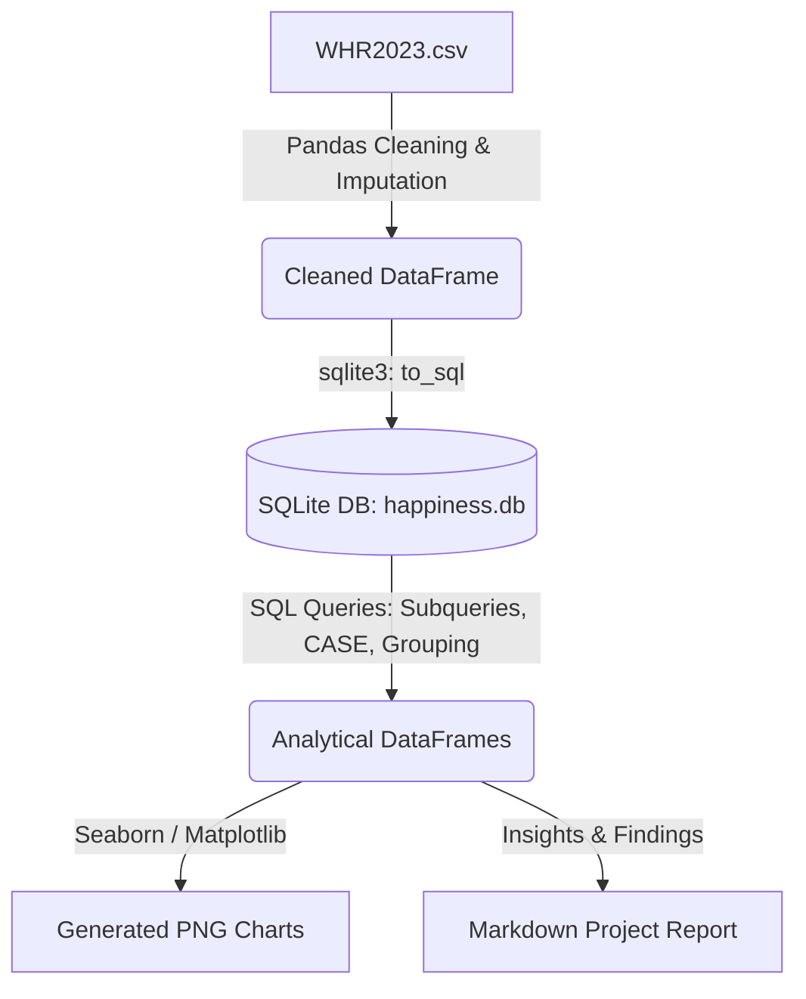
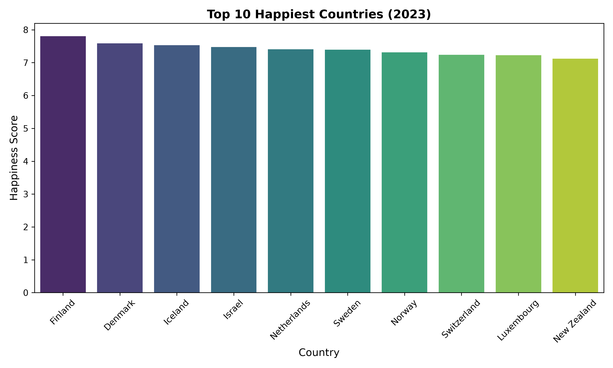
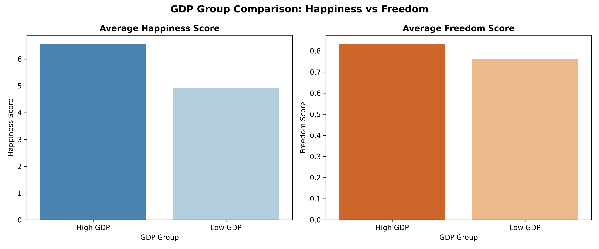
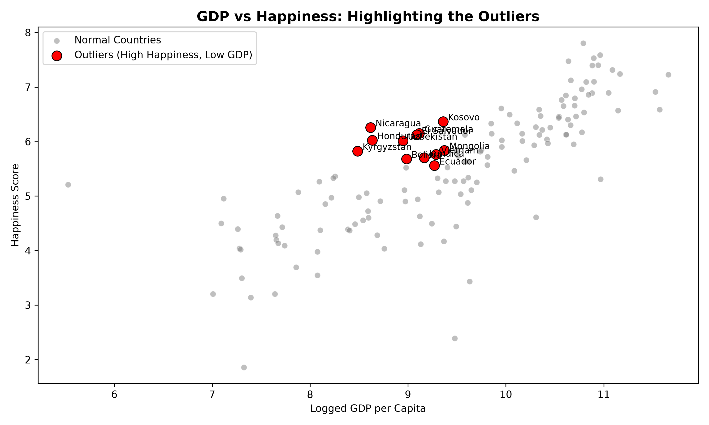

# World Happiness Report 2023: A Python & SQL Data Analysis Pipeline

This project demonstrates an end-to-end data engineering and analytics pipeline using **Python, Pandas, SQLite, and Seaborn/Matplotlib**. Instead of relying solely on local CSV analysis, this pipeline loads, cleans, and structures the World Happiness Report 2023 dataset into a relational database, queries it using intermediate/advanced SQL techniques, and visualizes the insights.

---

## 📊 Pipeline Architecture



---

## 🛠️ Tech Stack & Setup

*   **Language**: Python 3.x
*   **Libraries**: Pandas, Seaborn, Matplotlib, Sqlite3 (Standard Library)
*   **Database**: SQLite (Serverless RDBMS)

### How to Run the Pipeline

1.  **Initialize & Populate Database**:
    Run `project_db.py` to clean the raw `WHR2023.csv` data and load it into a local SQLite database file (`happiness.db`).
    ```bash
    py project_db.py
    ```
2.  **Execute SQL Queries**:
    Run `run_queries.py` to execute the analytical queries directly on the SQLite database and see the results in terminal.
    ```bash
    py run_queries.py
    ```
3.  **Generate Visualizations**:
    Run `visualize.py` to generate the analytical charts and save them to the `charts/` folder.
    ```bash
    py visualize.py
    ```

---

## 🔍 Key SQL Queries & Geopolitical Insights

### 1. Top 10 Happiest Countries
Extracting the highest-ranked countries globally along with their GDP and Perceptions of Corruption.
```sql
SELECT Country, Happiness_Score, GDP, Corruption
FROM happiness_report
ORDER BY Happiness_Score DESC
LIMIT 10;
```
*   **Insight**: Nordic countries (Finland, Denmark, Iceland) consistently occupy the top ranks. There is a strong baseline of high GDP and extremely low corruption perception (note: in this dataset, a lower corruption index value signifies less perceived corruption).

---

### 2. The GDP vs. Freedom Paradox
Grouping countries by GDP level to compare average Happiness and average Freedom of Choice.
```sql
SELECT
    CASE WHEN GDP >= 10 THEN 'High GDP' ELSE 'Low GDP' END AS gdp_group,
    AVG(Happiness_Score) AS avg_happiness_score,
    AVG(Freedom) AS avg_freedom
FROM happiness_report
GROUP BY gdp_group;
```
*   **Insight**: While average happiness scores drop significantly from High GDP (6.56) to Low GDP (4.93) countries, the perception of **Freedom to make life choices** remains relatively close (0.83 vs 0.76). This indicates that while financial security heavily drives overall life satisfaction, the feeling of personal freedom is less dependent on economic wealth alone.

---

### 3. High Happiness, Low GDP Outliers
Identifying countries that "punch above their weight" by showing happiness levels higher than the global average despite having a below-average GDP.
```sql
SELECT Country, Happiness_Score, GDP
FROM happiness_report
WHERE Happiness_Score > (SELECT AVG(Happiness_Score) FROM happiness_report)
  AND GDP < (SELECT AVG(GDP) FROM happiness_report)
ORDER BY Happiness_Score DESC;
```
*   **Insight**: This query reveals significant outliers like **Kosovo, Nicaragua, Guatemala, El Salvador, and Honduras**. These countries exhibit high life satisfaction despite lower economic indices. Sociological and cultural factors—such as tight-knit communities, strong family structures, social support systems, and a simpler lifestyle—play a substantial role in maintaining high happiness levels.

---

## 📈 Visualizations

All charts are saved in the `charts/` directory.

### Top 10 Happiest Countries


### GDP Group Comparison: Happiness vs. Freedom


### GDP vs. Happiness (Outliers Highlighted)

